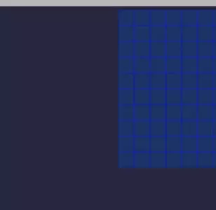

<h1 align="center">Hi 👋, I'm Nick</h1>
Thanks for visiting my profile! I am a full stack developer who specializes in JavaScript, React, Redux, Webpack, Firebase, MySQL, Node.js, Sequelize, and Express. Take a look at my work and get in touch! 

<h3 align="left">Connect with me:</h3>

<a align="center" href="https://linkedin.com/in/enplace" target="blank"> 
 https://www.linkedin.com/in/enplace/  
 </a>

<h3 align="left">About me:</h3>

I've spent most of my adult life teaching, and my love of learning and interest in pedagogy constantly drive me to teach myself new things. I moved to South America for a few years to continue teaching and to learn Spanish, at the time wanting to become an immigration lawyer. But things changed! After taking the LSAT and fortunately scoring well, I began teaching it and, meanwhile, started to learn programming on the side to boost my resume. 

It turns out that my love of language learning, logic, problem solving, and analytical thinking are really nicely combined in programming, and I chose to pursue a career in software development instead. I haven't looked back since, and continue to take joy in learning how to solve new problems every day.

 When I'm not building web apps or teaching the LSAT, I'm either watching sci-fi movies, running, or long-distance trekking through the mountains.

<h3 align="left">Languages and Tools:</h3>

                 

<!-- Resources 

&nbsp;
-->

 
<h1 align="center">Projects, Built From Scratch:</h1>

 

_____________________________________________________________________________

  

_____________________________________________________________________________
    

_____________________________________________________________________________

<a href="https://github.com/enPlace/bookmarked-react-firebase">
    
</a>   

_____________________________________________________________________________

  

_____________________________________________________________________________
 

